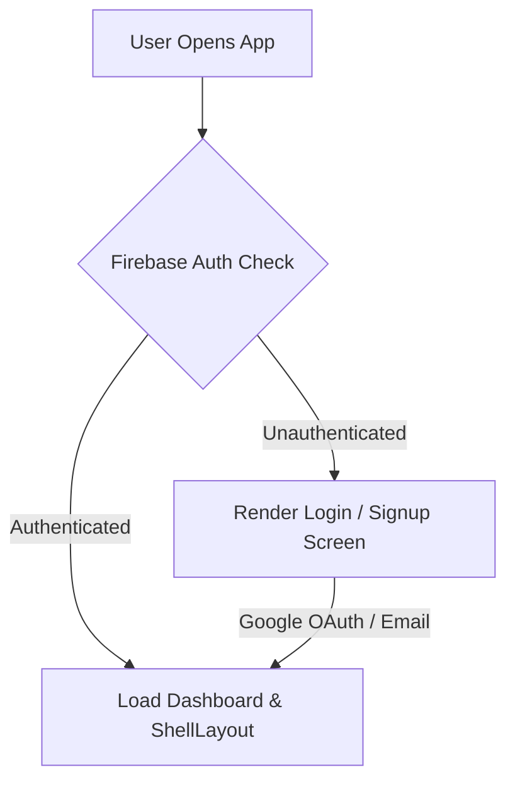
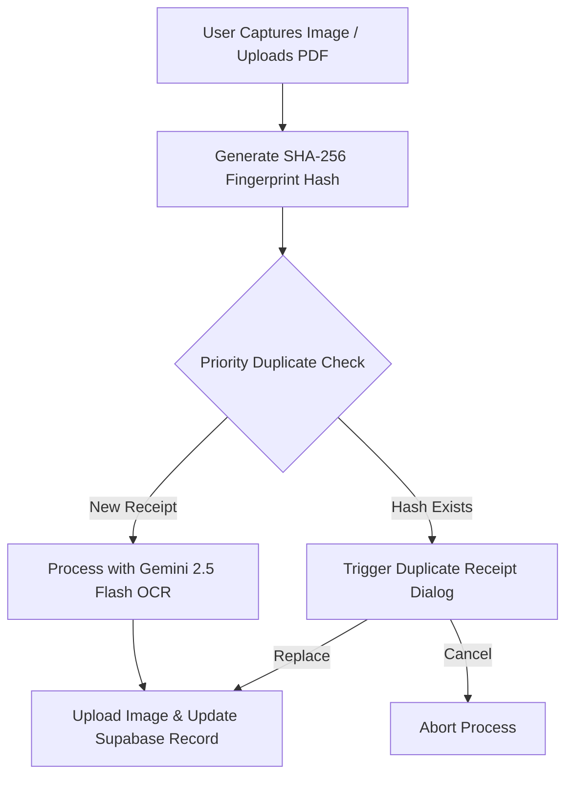
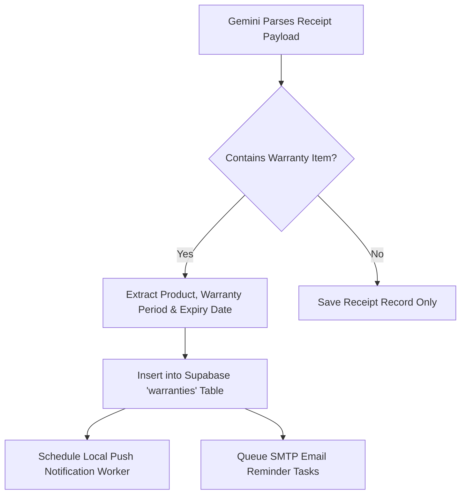
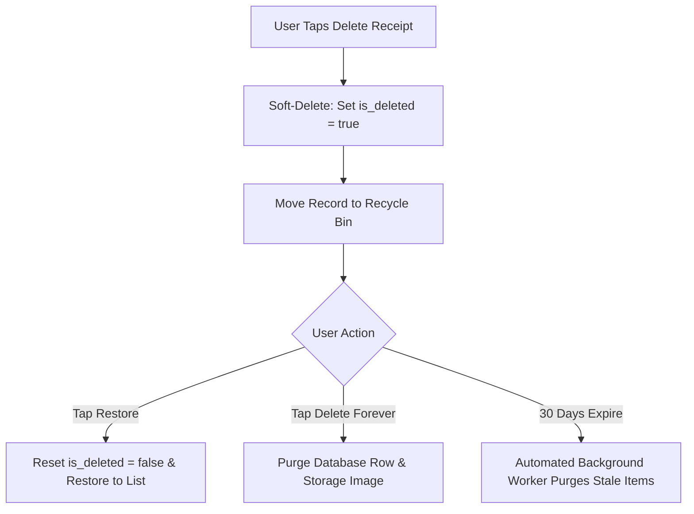

# Receipto 🧾 — AI-Powered Expense & Warranty Manager

[](https://flutter.dev)
[](https://dart.dev)
[](https://supabase.com)
[](https://firebase.google.com)
[](https://ai.google.dev)
[](LICENSE)

**Receipto** is a production-grade, privacy-focused mobile application built with Flutter that transforms how consumers and business professionals manage purchase receipts, track expenses, and safeguard product warranties.

---

## 📖 Introduction

### What is Receipto?
Receipto is an intelligent expense manager and warranty shield powered by **Google Gemini 2.5 Flash AI** and **Supabase Backend Services**. By combining advanced multimodal optical character recognition (OCR), automated warranty period extraction, intelligent duplicate detection, and a Google Photos-style Recycle Bin, Receipto turns paper clutter into actionable financial intelligence.

### Why It Was Built
Physical thermal receipts fade, tear, and get lost over time. When appliances break down or warranty claims are required years later, consumers often find themselves helpless without valid proof of purchase. Traditional expense apps require tedious manual data entry for every line item. Receipto was built to eliminate manual entry entirely: snap a photo, and the app extracts merchant details, purchase timestamps, items, totals, tax IDs, and warranty protection periods in seconds.

### Core Functionality
- **Automated AI Extraction**: Extract metadata, totals, categories, payment methods, line items, and warranty periods from scans or PDFs in under 3 seconds.
- **Smart Warranty Tracking**: Automatically schedule local phone push notifications and automated email reminders before warranties expire.
- **Gallery-Style Recycle Bin**: Soft-delete receipts into a 30-day Recycle Bin with instant restoration and auto-cleanup.
- **Duplicate Receipt Prevention**: 3-tier fingerprint hashing prevent uploading duplicate bills.
- **Professional PDF Export & Native Sharing**: Generate branded digital invoice PDFs complete with original receipt scan pages for tax and warranty claims.

---

## 📋 Table of Contents

1. [Project Features](#-project-features)
2. [Feature Checklist & Implementation Status](#-feature-checklist--implementation-status)
3. [Application Screenshots](#-application-screenshots)
4. [Tech Stack & Package Directory](#-tech-stack--package-directory)
5. [System Requirements](#-system-requirements)
6. [Flutter Installation & Setup](#-flutter-installation--setup)
7. [Android Phone & USB Debugging Setup](#-android-phone--usb-debugging-setup)
8. [Project Installation](#-project-installation)
9. [Firebase Authentication Setup](#-firebase-authentication-setup)
10. [Supabase Database & Storage Setup](#-supabase-database--storage-setup)
11. [Complete Supabase SQL Schema](#-complete-supabase-sql-schema)
12. [Google Gemini AI Setup](#-google-gemini-ai-setup)
13. [SMTP Email Reminders Setup](#-smtp-email-reminders-setup)
14. [Environment Configuration (.env)](#-environment-configuration-env)
15. [Project Architecture](#-project-architecture)
16. [Application Workflow Diagrams](#-application-workflow-diagrams)
17. [Running & Testing the Project](#-running--testing-the-project)
18. [Building Production APK](#-building-production-apk)
19. [Common Errors & Troubleshooting](#-common-errors--troubleshooting)
20. [Best Practices](#-best-practices)
21. [Future Enhancements](#-future-enhancements)
22. [Recent Updates & Version Highlights](#-recent-updates--version-highlights)
23. [Contributors](#-contributors)
24. [License](#-license)

---

## ✨ Project Features

> [!NOTE]
> All features listed below are 100% fully implemented and verified in the codebase.

### 🔐 1. Authentication System
- **Firebase Authentication**: Full user signup, email verification, login, password reset, and secure session management.
- **Google Sign-In**: Native one-tap Google OAuth 2.0 single sign-on integration.
- **Email Login**: Direct credential login with form validation and state persistence.
- **Persistent State**: Reactive Auth state listener powered by Flutter Riverpod (`firebaseAuthServiceProvider`).

### 📷 2. AI OCR & Receipt Processing
- **AI OCR**: Multimodal image & PDF optical character recognition powered by Google Gemini 2.5 Flash.
- **Receipt Parsing**: Automatic field parsing extracting invoice numbers, purchase timestamps, subtotal, tax amounts, discounts, and currency symbols (`₹`, `$`, `€`).
- **Merchant Extraction**: Automatic identification of merchant business name, physical street address, and contact numbers.
- **Product Extraction**: Line-item level parsing capturing item name, quantity, unit price, and total line-item price.
- **Warranty Detection**: Intelligent identification of eligible appliances/electronics and automated warranty period extraction (in months or years).

### 🏷️ 3. AI Receipt Categorization
- **Automatic AI Category Detection**: Classifies uploaded receipts into standard expense categories (Electronics, Groceries, Food & Dining, Fuel, Medical, Utilities, Shopping, etc.).
- **Gemini Classification**: Context-aware LLM prompt engineering for precise category assignment based on merchant & item context.
- **Keyword Fallback**: Offline keyword matching algorithm to guarantee instant classification when network is unavailable or API limits occur.
- **Stored Categories**: Standardized category tagging saved in Supabase database for consistent querying.
- **Category Filters**: Real-time filtering and grouping of receipts by category across the application.

### 💬 4. AI Warranty Assistant
- **AI Chat Assistant**: Dedicated conversational AI assistant (`AIAssistantScreen`) with quick prompt suggestions.
- **Natural Language Queries**: Freeform natural language inquiries (e.g., *"Is my laptop under warranty?"*, *"Show products expiring this month"*).
- **Warranty Lookup**: Instant lookup for active, expiring, or lifetime warranties.
- **Spending Queries**: Instant financial lookups by brand, category, month, or price threshold (e.g., *"How much did I spend this year?"*).
- **Merchant Queries**: Quick aggregation of purchases made at specific stores or merchants.
- **AI Generated Responses**: Uses Gemini intent detection combined with a local query engine to generate structured, human-friendly responses.

### 📊 5. Professional Analytics Dashboard
- **Monthly Spending Analysis**: In-depth breakdown of monthly expenses, average transaction totals, and net discount savings.
- **Monthly Comparison**: Month-over-month spending comparison and variance analytics.
- **Category Breakdown**: Dynamic category distribution visualization detailing spending proportions.
- **Interactive Weekly Activity**: Tap-to-inspect weekly activity chart with daily spending bars and detailed day-by-day itemization.
- **Merchant Analytics**: Aggregated spending by merchant with transaction frequency metrics.
- **Warranty Analytics**: Overview of warranty inventory value, active coverage counts, and upcoming expiration liabilities.
- **Budget & Forecast**: Custom monthly budget setting with `SharedPreferences` persistence, spending rate forecasting, and budget alerts.
- **AI Spending Insights**: Context-aware AI insights highlighting top spending categories, unusual spikes, and savings opportunities.
- **Summary Cards**: Frosted glass summary cards for total spending, active warranties, discount savings, and budget health.
- **Empty State Handling**: Smooth dark glassmorphism placeholder states when no receipts or warranties are present.
- **Performance Optimizations**: Multi-level calculation caching (`_cachedData`) preventing redundant re-computations and guaranteeing fluid 60fps scrolling.

### 🛡️ 6. Warranty Management
- **Active Warranties**: View all active product warranties with live coverage indicators.
- **Expiring Warranties**: Highlighted warning cards for products expiring within 30 days.
- **Expired Warranties**: Historical tracking archive for products past their warranty coverage date.
- **Remaining Days**: Real-time countdown indicator showing exact remaining coverage days.
- **Warranty Timeline**: Visual timeline showcasing purchase dates, current milestone, and exact expiration targets.

### 🔔 7. Warranty Reminder System
- **Local Notifications**: Device push notifications scheduled at 30, 15, 7, 3, 1, and 0 days prior to warranty expiration (`flutter_local_notifications`).
- **Email Reminders**: Automated HTML email notification worker sending alerts directly to the user's email inbox using `mailer`.
- **Reminder Scheduling**: Timezone-aware notification scheduler (`flutter_timezone`, `timezone`).
- **SMTP Email Support**: Secure background SMTP mail client configuration supporting Gmail App Passwords.
- **Automatic Reminder Processing**: State-tracked notification flags (`notification_30_sent`, `email_30_sent`) to eliminate duplicate alerts.

### 🔍 8. Priority Duplicate Receipt Detection
Prevents double-counting expenses using a 3-tier algorithm:
1. **Priority 1**: SHA-256 fingerprint hash comparison (`receipt_hash` generated from `merchant_name + invoice_number + date + total`).
2. **Priority 2**: Exact 4-field matching (`invoice_number`, `merchant_name`, `purchase_date`, `grand_total`).
3. **Priority 3**: Fallback matching when invoice number is missing: filename + file size + Jaccard OCR text token similarity (>80%).
- Provides user choice: **Cancel Upload** or **Replace Existing Receipt**.

### 🗑️ 9. Gallery-Style Recycle Bin
- Soft-delete system using `is_deleted = true` and `deleted_at` timestamp.
- Receipts moved to Recycle Bin remain safely stored for 30 days.
- Options: **Restore Receipt**, **Delete Forever**, or **Empty Bin**.
- Automated background worker permanently purges receipts older than 30 days.

### 📄 10. Digital PDF Export & Native Sharing
- Generates branded, multi-page digital invoice PDFs using `pdf` and `printing`.
- Page 1 includes merchant information, items table, financial summary, and warranty details; Page 2 embeds the original high-res scan image.
- Native share sheet integration (`share_plus`) supporting PDF, original image, PDF + image combo, or text summary exports.

### 🎨 11. Dark Glassmorphism Design System
- Modern dark mode aesthetic built with custom HSL color tokens (`AppColors`), radial nebula backgrounds, frosted glass cards (`GlassCard`), and 250ms micro-animations.

---

## ✅ Feature Checklist & Implementation Status

| Feature Module | Implementation Status | Core Technologies & Capability |
| :--- | :---: | :--- |
| **AI Receipt Scanner** | ✅ Implemented | Gemini 2.5 Flash multimodal OCR for photos & PDFs |
| **AI Receipt Categorization** | ✅ Implemented | Gemini AI classification with local keyword fallback |
| **AI Warranty Assistant** | ✅ Implemented | Natural language chat assistant with intent parsing engine |
| **Professional Analytics Dashboard**| ✅ Implemented | Monthly analysis, interactive weekly charts, merchant/warranty analytics |
| **Budget Forecast** | ✅ Implemented | Monthly budget configuration & spending velocity forecast |
| **Warranty Tracking** | ✅ Implemented | Active/Expiring status, days remaining countdown & timeline |
| **Merchant Analytics** | ✅ Implemented | Merchant spend breakdown & frequency tracking |
| **Email Reminder System** | ✅ Implemented | Background SMTP HTML email notifications via `mailer` |
| **Local Notifications** | ✅ Implemented | Scheduled push notifications (30, 15, 7, 3, 1, 0 days) |
| **Firebase Authentication** | ✅ Implemented | Email/Password & Native Google OAuth Sign-In |
| **Duplicate Receipt Detection** | ✅ Implemented | 3-tier SHA-256 hash & Jaccard text token similarity |
| **Recycle Bin & Soft Delete** | ✅ Implemented | 30-day soft-delete retention with automated purge worker |
| **Digital PDF Export** | ✅ Implemented | Multi-page invoice PDF generation & native OS share sheet |

---

## 🖼️ Application Screenshots

| Login Screen | Dashboard Screen |
| :---: | :---: |
|  |  |

| Analytics Dashboard | AI Warranty Assistant |
| :---: | :---: |
|  |  |

| Receipt Scanner | Warranty Tracking |
| :---: | :---: |
|  |  |

---

## 🛠️ Tech Stack & Package Directory

| Technology | Role / Purpose |
| :--- | :--- |
| **Flutter 3.29** | Cross-platform UI framework for Android & iOS |
| **Dart 3.7** | Strongly-typed client-side programming language |
| **Material 3** | Google Material Design 3 component system & typography |
| **Firebase Auth** | Identity management, Email authentication & Google OAuth 2.0 |
| **Supabase DB** | Production PostgreSQL relational cloud database |
| **Supabase Storage** | Cloud object storage for receipt scan images |
| **Flutter Riverpod** | Reactive state management & dependency injection |
| **GoRouter** | Declarative routing with StatefulShellRoute bottom tabs |
| **Google Gemini API** | Multimodal LLM (Gemini 2.5 Flash) for OCR, classification & AI chat assistant |
| **SMTP Mail** | Direct background SMTP email reminder delivery (`mailer`) |
| **Flutter Local Notifications** | Device scheduled push notification reminders |
| **SharedPreferences** | Key-value local persistence for budget limits & user settings |
| **Custom Charts** | Interactive weekly spending bar charts & sparklines |
| **PDF & Printing** | Invoice PDF compilation and preview rendering |
| **Share Plus & Open Filex** | Native OS share sheet and local file launcher |

### Primary Pubspec Dependencies
```yaml
dependencies:
  flutter:
    sdk: flutter
  flutter_riverpod: ^2.5.1
  go_router: ^14.2.7
  google_fonts: ^6.2.1
  firebase_core: ^4.11.0
  firebase_auth: ^6.5.4
  google_sign_in: ^7.2.0
  supabase_flutter: ^2.15.2
  flutter_dotenv: ^6.0.1
  image_picker: ^1.2.2
  camera: ^0.11.0+2
  file_picker: ^8.0.0
  path_provider: ^2.1.3
  pdf: ^3.12.0
  printing: ^5.14.3
  share_plus: ^12.0.2
  open_filex: ^4.7.0
  flutter_local_notifications: ^20.1.0
  mailer: ^7.1.0
  local_auth: ^3.0.1
  crypto: ^3.0.7
  shared_preferences: ^2.5.2
  workmanager: ^0.9.0+3
  shimmer: ^3.0.0
```

---

## 💻 System Requirements

Before setting up Receipto, ensure your environment meets the following specifications:

- **Operating System**: Windows 10/11, macOS (12+), or Linux (Ubuntu 22.04+)
- **Flutter SDK**: Version 3.29.0 or higher
- **Dart SDK**: Version 3.7.0 or higher
- **JDK / Java**: OpenJDK 17 or Version 21
- **Android Studio**: Ladybug (2024.2+) or build tools `34.0.0`
- **Android Device**: Physical device or Emulator with Android 8.0+ (API Level 26+)
- **Git**: Version 2.40+
- **Network**: Active broadband connection (for Gemini API, Firebase Auth, and Supabase Sync)

---

## ⚙️ Flutter Installation & Setup

### Step 1: Install Flutter SDK
1. Download the Flutter SDK stable zip from the official site: [flutter.dev/docs/get-started/install](https://docs.flutter.dev/get-started/install).
2. Extract the archive to a clean directory (e.g. `C:\src\flutter` on Windows or `~/development/flutter` on macOS).

### Step 2: Configure System Environment PATH
- **Windows**: Search for *Environment Variables* -> Edit User/System Path -> Add `C:\src\flutter\bin`.
- **macOS/Linux**: Add the following line to `~/.zshrc` or `~/.bashrc`:
  ```bash
  export PATH="$HOME/development/flutter/bin:$PATH"
  ```
- Reopen your terminal and verify:
  ```bash
  flutter --version
  ```

### Step 3: Run Flutter Doctor & Accept Licenses
Execute `flutter doctor` to inspect missing tooling:
```bash
flutter doctor
```
Accept Android SDK licenses:
```bash
flutter doctor --android-licenses
```
*(Press `y` to accept all license prompts)*.

---

## 📱 Android Phone & USB Debugging Setup

### Step 1: Enable Developer Options
1. Open **Settings** on your Android phone.
2. Navigate to **About Phone** -> Locate **Build Number**.
3. Tap **Build Number** 7 times until you see `"You are now a developer!"`.

### Step 2: Enable USB Debugging
1. Go back to **Settings** -> **System** -> **Developer Options**.
2. Toggle **USB Debugging** to `ON`.

### Step 3: Connect & Authorize
1. Connect your phone to your PC via a USB cable (use a data-transfer capable cable).
2. Look at your phone screen and check **"Always allow from this computer"** when prompted, then tap **Allow**.
3. Verify device connection in terminal:
   ```bash
   flutter devices
   ```
   *Output should list your connected physical phone.*

---

## 🚀 Project Setup

### 1. Clone Repository
```bash
git clone https://github.com/your-username/receipto.git
cd receipto
```

### 2. Clean Build Cache & Fetch Packages
```bash
flutter clean
flutter pub get
```

### 3. Create Environment File
Create a `.env` file in the root directory of the project:
```bash
touch .env
```
*(Populate `.env` with keys as described in the [Environment Configuration](#-environment-configuration-env) section).*

---

## 🔥 Firebase Authentication Setup

Receipto uses Firebase for Identity and OAuth authentication.

1. Go to the [Firebase Console](https://console.firebase.google.com/) and click **Create Project** (`receipto-app`).
2. Click **Add App** -> Select **Android**.
3. Enter your Android Package Name (e.g., `com.example.receipto`).
4. Generate and register your SHA-1 fingerprint:
   ```bash
   cd android
   ./gradlew signingReport
   ```
5. Copy the `SHA1` string from the terminal output and paste it into the Firebase App settings.
6. Download the `google-services.json` file.
7. Place `google-services.json` directly into `android/app/google-services.json`.
8. In Firebase Console, go to **Authentication** -> **Sign-in method**:
   - Enable **Email/Password**.
   - Enable **Google Sign-In**.

---

## ⚡ Supabase Database & Storage Setup

Receipto uses Supabase for storing relational data and hosting uploaded scan images.

1. Create a project at [supabase.com](https://supabase.com).
2. Go to **Project Settings** -> **API**:
   - Copy **Project URL** (`SUPABASE_URL`).
   - Copy **anon / public key** (`SUPABASE_ANON_KEY`).
3. Go to **Storage**:
   - Create a new public bucket named `receipts_bucket`.
   - Enable public access so receipt images can be loaded via HTTPS image URLs.

---

## 🗄️ Complete Supabase SQL Schema

> [!IMPORTANT]
> Copy and paste the entire SQL block below directly into your **Supabase Dashboard -> SQL Editor** and click **Run**. This contains all table definitions, columns, primary/foreign keys, indexes, timestamps, soft-delete columns, and migration statements required for a fresh database installation.

```sql
-- =========================================================
-- RECEIPTO COMPLETE SUPABASE DATABASE SCHEMA MIGRATION
-- =========================================================

-- 1. PROFILES TABLE
CREATE TABLE IF NOT EXISTS public.profiles (
    id UUID PRIMARY KEY REFERENCES auth.users(id) ON DELETE CASCADE,
    email TEXT,
    full_name TEXT,
    avatar_url TEXT,
    created_at TIMESTAMPTZ DEFAULT NOW()
);

-- 2. RECEIPTS TABLE
CREATE TABLE IF NOT EXISTS public.receipts (
    id BIGINT GENERATED ALWAYS AS IDENTITY PRIMARY KEY,
    user_id TEXT NOT NULL,
    merchant_name TEXT,
    date TEXT,
    time TEXT,
    receipt_number TEXT,
    invoice_number TEXT,
    receipt_hash TEXT NULL,
    file_size BIGINT NULL,
    confidence_score DOUBLE PRECISION NULL,
    gst_number TEXT,
    payment_method TEXT,
    currency TEXT DEFAULT '₹',
    grand_total DOUBLE PRECISION,
    total DOUBLE PRECISION,
    tax DOUBLE PRECISION,
    discount DOUBLE PRECISION,
    subtotal DOUBLE PRECISION,
    category TEXT,
    image_url TEXT,
    merchant_address TEXT,
    merchant_phone TEXT,
    original_file_name TEXT,
    raw_text TEXT,
    is_deleted BOOLEAN DEFAULT FALSE,
    deleted_at TIMESTAMPTZ NULL,
    created_at TIMESTAMPTZ DEFAULT NOW()
);

-- 3. RECEIPT ITEMS TABLE
CREATE TABLE IF NOT EXISTS public.receipt_items (
    id BIGINT GENERATED ALWAYS AS IDENTITY PRIMARY KEY,
    receipt_id BIGINT REFERENCES public.receipts(id) ON DELETE CASCADE,
    name TEXT NOT NULL,
    quantity DOUBLE PRECISION DEFAULT 1,
    unit_price DOUBLE PRECISION DEFAULT 0,
    total_price DOUBLE PRECISION DEFAULT 0,
    warranty_available BOOLEAN DEFAULT FALSE,
    warranty_period INT NULL,
    warranty_unit TEXT NULL,
    created_at TIMESTAMPTZ DEFAULT NOW()
);

-- 4. WARRANTIES TABLE
CREATE TABLE IF NOT EXISTS public.warranties (
    id BIGINT GENERATED ALWAYS AS IDENTITY PRIMARY KEY,
    user_id TEXT NOT NULL,
    receipt_id BIGINT REFERENCES public.receipts(id) ON DELETE CASCADE,
    product_name TEXT NOT NULL,
    merchant_name TEXT NOT NULL,
    invoice_number TEXT NULL,
    purchase_date TEXT NOT NULL,
    warranty_period INT NOT NULL,
    warranty_unit TEXT NOT NULL,
    expiry_date TEXT NOT NULL,
    image_url TEXT NULL,
    status TEXT DEFAULT 'ACTIVE',
    brand TEXT NULL,
    model TEXT NULL,
    serial_number TEXT NULL,
    notification_30_sent BOOLEAN DEFAULT FALSE,
    notification_15_sent BOOLEAN DEFAULT FALSE,
    notification_7_sent BOOLEAN DEFAULT FALSE,
    notification_3_sent BOOLEAN DEFAULT FALSE,
    notification_1_sent BOOLEAN DEFAULT FALSE,
    notification_today_sent BOOLEAN DEFAULT FALSE,
    notification_expired_sent BOOLEAN DEFAULT FALSE,
    email_30_sent BOOLEAN DEFAULT FALSE,
    email_15_sent BOOLEAN DEFAULT FALSE,
    email_7_sent BOOLEAN DEFAULT FALSE,
    email_3_sent BOOLEAN DEFAULT FALSE,
    email_1_sent BOOLEAN DEFAULT FALSE,
    email_today_sent BOOLEAN DEFAULT FALSE,
    email_expired_sent BOOLEAN DEFAULT FALSE,
    created_at TIMESTAMPTZ DEFAULT NOW()
);

-- 5. NOTIFICATIONS TABLE
CREATE TABLE IF NOT EXISTS public.notifications (
    id BIGINT GENERATED ALWAYS AS IDENTITY PRIMARY KEY,
    user_id TEXT NOT NULL,
    title TEXT NOT NULL,
    message TEXT NOT NULL,
    is_read BOOLEAN DEFAULT FALSE,
    created_at TIMESTAMPTZ DEFAULT NOW()
);

-- =========================================================
-- INDEXES FOR HIGH-PERFORMANCE QUERYING
-- =========================================================
CREATE INDEX IF NOT EXISTS idx_receipts_user_id ON public.receipts(user_id);
CREATE INDEX IF NOT EXISTS idx_receipts_hash ON public.receipts(receipt_hash);
CREATE INDEX IF NOT EXISTS idx_receipts_deleted ON public.receipts(is_deleted);
CREATE INDEX IF NOT EXISTS idx_receipt_items_receipt_id ON public.receipt_items(receipt_id);
CREATE INDEX IF NOT EXISTS idx_warranties_user_id ON public.warranties(user_id);
CREATE INDEX IF NOT EXISTS idx_warranties_receipt_id ON public.warranties(receipt_id);
CREATE INDEX IF NOT EXISTS idx_notifications_user_id ON public.notifications(user_id);

-- =========================================================
-- MIGRATION STATEMENTS (FOR EXISTING TABLES)
-- =========================================================
ALTER TABLE public.receipts ADD COLUMN IF NOT EXISTS receipt_hash TEXT NULL;
ALTER TABLE public.receipts ADD COLUMN IF NOT EXISTS file_size BIGINT NULL;
ALTER TABLE public.receipts ADD COLUMN IF NOT EXISTS is_deleted BOOLEAN DEFAULT FALSE;
ALTER TABLE public.receipts ADD COLUMN IF NOT EXISTS deleted_at TIMESTAMPTZ NULL;

-- Enable Row Level Security (RLS)
ALTER TABLE public.receipts ENABLE ROW LEVEL SECURITY;
ALTER TABLE public.receipt_items ENABLE ROW LEVEL SECURITY;
ALTER TABLE public.warranties ENABLE ROW LEVEL SECURITY;
ALTER TABLE public.notifications ENABLE ROW LEVEL SECURITY;

-- Allow Public Access Policies (for rapid setup; refine for production)
CREATE POLICY "Public Read/Write Receipts" ON public.receipts FOR ALL USING (true) WITH CHECK (true);
CREATE POLICY "Public Read/Write Receipt Items" ON public.receipt_items FOR ALL USING (true) WITH CHECK (true);
CREATE POLICY "Public Read/Write Warranties" ON public.warranties FOR ALL USING (true) WITH CHECK (true);
CREATE POLICY "Public Read/Write Notifications" ON public.notifications FOR ALL USING (true) WITH CHECK (true);
```

---

## 🤖 Google Gemini AI Setup

Receipto uses Google's multimodal **Gemini 2.5 Flash** model for processing images/PDFs and returning structured JSON metadata.

1. Visit [Google AI Studio](https://aistudio.google.com/).
2. Click **Create API Key**.
3. Copy your key and place it inside your `.env` file under `GEMINI_API_KEY`.

> [!TIP]
> If your API key expires or hits quota limits, generate a new key from Google AI Studio and update `GEMINI_API_KEY` in `.env` without re-building the entire application.

---

## 📧 SMTP Email Reminders Setup

Automated warranty reminder emails require a valid SMTP sender account.

1. Log into your Google Account -> Go to **Security**.
2. Enable **2-Step Verification**.
3. Under *2-Step Verification*, scroll down to **App passwords**.
4. Create an App password named `Receipto App` and copy the 16-character generated password.
5. Add your SMTP credentials to your `.env` file (`SMTP_HOST`, `SMTP_PORT`, `SMTP_USERNAME`, `SMTP_PASSWORD`, `SMTP_SENDER`).

---

## 🔑 Environment Configuration (.env)

Create a file named `.env` in the root folder of your project (`receipto/.env`):

```env
# SUPABASE BACKEND CONFIGURATION
SUPABASE_URL=YOUR_SUPABASE_PROJECT_URL
SUPABASE_ANON_KEY=YOUR_SUPABASE_ANON_KEY

# GOOGLE AI GEMINI CONFIGURATION
GEMINI_API_KEY=YOUR_GEMINI_API_KEY

# SMTP EMAIL REMINDER CONFIGURATION
SMTP_HOST=smtp.gmail.com
SMTP_PORT=587
SMTP_USERNAME=your-email@gmail.com
SMTP_PASSWORD=your-16-char-app-password
SMTP_SENDER=your-email@gmail.com
```

> [!CAUTION]
> Never commit your actual `.env` file or API secrets to public repositories! `.env` is included in `.gitignore`.

---

## 🏗️ Project Architecture

```
receipto/
├── android/                   # Native Android host configuration
├── assets/                    # Project static assets & fonts
│   ├── animations/            # Lottie / Rive animation assets
│   ├── fonts/                 # Google Fonts definitions
│   ├── icons/                 # App launcher and custom iconography
│   └── images/                # Background wallpapers & graphics
├── lib/
│   ├── app/                   # App root entry point, theme & route configuration
│   │   ├── config/            # GoRouter routes & dark glassmorphism theme tokens
│   │   └── app.dart           # MaterialApp entry point
│   ├── core/                  # Core constants, services, utilities & shared widgets
│   │   ├── constants/         # AppColors, AppGradients, AppSpacing & AppRadius tokens
│   │   ├── services/          # Supabase, Firebase, Gemini, PDF, Email & Local Auth services
│   │   ├── utils/             # CurrencyFormatter, WarrantyUtils & Date parsers
│   │   └── widgets/           # GlassCard, GradientButton, ShellLayout & Nebula background
│   └── features/              # Feature-driven modular architecture
│       ├── analytics/         # Analytics screen, provider & weekly chart widgets
│       ├── auth/              # Login, Signup, Auth controller & Firebase state
│       ├── dashboard/         # Main dashboard, spending summary & sparkline charts
│       ├── notifications/     # Notification center, DB service & local push triggers
│       ├── profile/           # User profile screen, app settings & Recycle Bin trigger
│       ├── receipts/          # Receipts list, detail screen, PDF viewer & share sheet
│       ├── scan/              # Scanner UI, camera screen, Gemini OCR service & repository
│       └── warranty/          # Warranty tracker, animated warranty card & notification worker
├── test/                      # Unit and widget test suite
├── .env                       # Local environment secrets configuration
├── migration.sql              # Supabase database SQL schema script
└── pubspec.yaml               # Flutter package dependencies declaration
```

---

## 🔄 Application Workflow Diagrams









---

## 🧪 Running & Testing the Project

### Execute Local Development Server
```bash
# Clean build cache
flutter clean

# Fetch updated packages
flutter pub get

# Run on connected Android device
flutter run
```

### Static Analysis & Verification
Ensure zero lints, unused imports, or code style errors:
```bash
flutter analyze
```

### Execute Test Suite
```bash
flutter test
```

---

## 📦 Building Production APK

To compile a signed or standalone production APK for Android:

```bash
# Clean project
flutter clean
flutter pub get

# Build Release APK
flutter build apk --release
```

The compiled APK will be available at:
`build/app/outputs/flutter-apk/app-release.apk`

---

## 🛠️ Common Errors & Troubleshooting

### 1. `A borderRadius can only be given on borders with uniform colors`
- **Cause**: Mixing different border side colors (`left: ..., top: ...`) with `BorderRadius`.
- **Solution**: Use uniform `Border.all(...)` and embed a `Positioned` colored accent strip inside a `Stack`.

### 2. `Could not start thread DartWorker: 22` (Windows Compiler Failure)
- **Cause**: Windows file lock or Dart worker isolate memory exhaustion during compilation.
- **Solution**: Run `flutter clean`, close VS Code/Android Studio instances, and rerun `flutter run`.

### 3. `Gemini API Quota Exceeded (HTTP 429)`
- **Cause**: Free tier Google AI Studio API rate limit reached.
- **Solution**: Generate a new API key at [aistudio.google.com](https://aistudio.google.com) and update `GEMINI_API_KEY` in `.env`.

### 4. `USB Device Not Detected in flutter devices`
- **Cause**: USB cable is charge-only or ADB authorization was declined.
- **Solution**: Switch to a data-transfer USB cable, toggle USB Debugging OFF and ON, and run `adb kill-server && adb start-server`.

---

## 💡 Best Practices

1. **Keep Secrets Secret**: Never push `.env`, `google-services.json`, or API keys to version control.
2. **Run Lints Constantly**: Execute `flutter analyze` before pushing code to ensure zero warnings.
3. **Database Integrity**: Always handle soft-deleted receipts (`is_deleted = true`) explicitly in Supabase database queries.

---

## 🚀 Future Enhancements

The following roadmap features are planned for future development and releases of Receipto (currently NOT implemented):

- ⏳ **AI Financial Health Score**: Advanced financial stability metric and spending score computed from multi-month receipt patterns.
- ⏳ **Product Price Tracking**: Merchant price drop notifications and historical price trend tracking for purchased products.
- ⏳ **Smart Recall Alerts**: Automated manufacturer safety recall alerts matching scanned receipt product models.
- ⏳ **Warranty Claim Assistant**: Interactive AI wizard to draft formal warranty claim emails and claim documentation for manufacturers.
- ⏳ **Smart Product Passport**: Ownership verification and resale transfer passport for high-value warranted assets.

---

## 📝 Recent Updates & Version Highlights

### Version 1.0.0 - Production Feature Suite
- **Professional Analytics Dashboard**: Redesigned Analytics module with Monthly Spending Analysis, Monthly Comparison, Category Breakdown, Interactive Weekly Activity, Merchant Analytics, Warranty Analytics, Budget & Forecast, and AI Spending Insights.
- **AI Warranty Assistant**: Interactive conversational AI assistant capable of processing natural language queries regarding warranties, receipts, merchants, and spending threshold lookups.
- **AI Receipt Categorization**: Multimodal Gemini receipt classification engine with fallback local keyword matching across 25+ categories.
- **Budget Forecast Engine**: Custom monthly spending budget configuration with `SharedPreferences` persistence and real-time forecast tracking.
- **Merchant Analytics**: Detailed spend aggregation and merchant transaction frequency breakdown.
- **Warranty Analytics**: Full asset warranty lifecycle tracking covering active, expiring, and expired items with remaining days countdown.
- **Email Reminder Improvements**: SMTP background worker providing automated HTML email reminders for expiring product warranties.

---

## 👥 Contributors

- **Lead Developer**: Receipto Engineering Team
- **UI/UX Design**: Receipto Dark Glassmorphism Studio
- **AI Integration**: Google DeepMind / Gemini API Community

---

## 📄 License

This project is licensed under the MIT License - see the [LICENSE](LICENSE) file for details.

